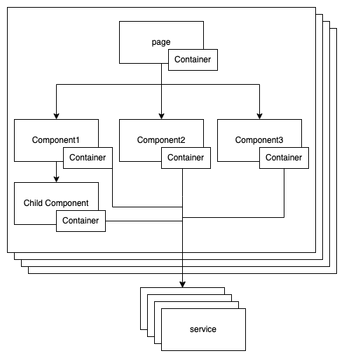

# Front Project

This is a [Next.js](https://nextjs.org/) project bootstrapped with [`create-next-app`](https://github.com/vercel/next.js/tree/canary/packages/create-next-app).

## Getting Started

First, run the development server:

```bash
npm run dev
# or
yarn dev
```

Open [http://localhost:8000](http://localhost:8000) with your browser to see the result.

## Development Stack

[Next.js](https://nextjs.org/)(Framework)  
[Tailwindcss](https://tailwindcss.com/)(Class Utilities)  
[Tailwind Elements](https://tailwind-elements.com/)(UI Components)  
[React-Query](https://react-query.tanstack.com/)(API Fetch, Server Side Management)

## File Structure

<pre>
├ components : 화면을 구성하는데 필요한 UI Component & Container
    ├ common
        ├ button
            ├ _hook.tsx : Button hook
            ├ signup.tsx : Button UI
        ...
    ...
├ constants : App 에 필요한 상수
├ docs : App 관련 documents
├ feature : Next.js route pages
    ├ page1
        ├ container.tsx : page1 container
        ├ index.tsx : page1 presenter
    ├ page2
        ├ container.tsx : page2 container
        ├ index.tsx : page2 presenter
    ...
├ pages : Next.js route pages
    ├ _app.tsx
    ├ _document.tsx
    ├ page1.tsx
    ├ page2.tsx
    ...
├ public : "base URL" based static files
├ service : 외부 services
├ styles : stylesheets
</pre>


